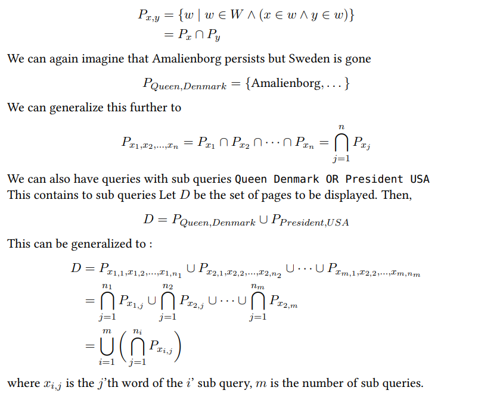

# Searchly---Search-Engine-Refactored
Introductory Programming Final Project 2021, using Java programming language

# Group 18
* Lukas Dannebrog Jensen - Team lead
* Ryan Williams - Implement Task 2 - Task 3
* Ausrine Kriucokaite - Implement Task 2 - Task 3
* Bence Kovacs - Implement Task 4 - Task 5

# Introduction
> This document reports on the search engine project that we developed during the Introductory Programming course at the IT University of Copenhagen. In Sections 1–5 we willreport on our solutions to the mandatory tasks posed in the project description.  The description for each solution is roughly split up into the following parts:
- Task:A short review on the task that we had to solve.

- Approach:An informal, high-level description of how we solved the task.

- Solution:A detailed technical description of our solution to the task.

- Reflections:Thoughts about solution, including known bugs or shortcomings.

> The source code of our project is handed in as a single zip file called group18.zip.  The directory GP21-group18contains the project-files that solves the mandatory tasks. All of the code was written by us or contained in the template, some of the hashcode methods were generated by VS-code’s source action command. Our code is also available on ITU’s Github:https://github.itu.dk/mahv/GP21-group18.

# Task 1: Refactoring

> The given task was to refactor the existing code to establish a cleaner code base and prepare it for the implementation of new features. 
#### Approach
> We have decided to introduce new classes for our initial prototype to achieve higher cohesiveness, less coupling and reduce overall complexity within the system. In addition, we have decided to extract parts of the code into separate methods, rename variables and discarded the use of local variable type inference (\texttt{var}), where the data type was not obvious,  to improve code readability.
#### Solution
> We have gone through several iterations of the class diagram. We started out with a class diagram that could support task 2, then gradually updated it to support the rest of the required functionality. The final version of initial prototype can be seen in figure 1.
#### Solution
> We decided to break down the system into separate parts that could be represented as an individual object with it's own behaviour and attributes. Also, we wanted to make sure that the new architecture could support new features developed in tasks 2-5. Therefore, we have introduced 5 additional classes that all combined create an improved version of the search engine:

- Page.java- represents a Page object. It is responsible for storing all the given infor-mation in the data files: a title, an url and content, as well as modifying the title and url fields into a JSON format.

- WebSet.java- represents a set of Pages. It is responsible for enabling search engineto support more complex search queries by creating intersections and unions between sets, as well as unifying multiple websets.

- Ranker.java- represents a Ranker object.   It is responsible for ranking matched queries by utilizing a term frequency-inverse document score (tf-idf ).

- QueryHandler.java- represents a QueryHandler object.  It is responsible for the processing of search queries and matching them with the pages by utilizing the Inverted Index.

- InvertedIndex.java- represents data structure based on the inverted index.  It is responsible for storing a mapping of search queries and corresponding pages.

- WebServer.java- represents a WebServer object. It is responsible for creating, from file,  processing and delivering web pages,  it also takes the http request,  that will trigger the search.

# Task 2: Modifying the Basic Search Engine

> The given task was to output a message informing a user that no web pages matched the given search term if no matches were found. Additionally, the program could create a web page only if it contained a title and at least one word.

#### Approach

> We have modified a document object with the id attribute "responsesize" in
the the code.js to display a message if content of web pages did not match the given query.
Furthermore, we have modified the reading of the data files in the InvertedIndex class,
loadPages(String filename) method, such that it only created a web page if it contained
a title and and at least one word.

#### Solution

> In code.js, we have decided to implement a ternary conditional operator to make
our code more concise followed by additional if/else statements. The condition states that
if data.length equals to 0 then the program outputs a paragraph containing the following
message: "No web page contains the query word." If the condition is not met, then web
pages matching the given query will be displayed. We have further modified the style of
the document object with the id attribute "urllist" to remove a frame from the url list if
no pages are returned. We have implemented the solution using an if/else statement and
two properties: style and display. The condition states that if url list does not contain any
pages, the element is removed else the program displays search results as a block element.
In regards of loadPages(String filename) method, first we have identified the following
criteria for a page to be valid:

- it must contain an url
- it must contain a title
- it must contain at least one word

> In order to check if the given page meets all the criteria, we must track url, title and content.
Therefore we have declared three local variables:

- String currentUrl
- String currentTitle
- ArrayList<String> currentContents

> Alongside, we have implemented three boolean checks combined with AND operator that
checks if these variables are not empty:

- !currentUrl.isEmpty() && !currentContents.isEmpty() && !currentTitle.isEmpty())
  
> First, the program loads contents from the data file and reads them line by line using a for
loop. In this for loop, we populate currentUrl, currentTitle and currentContent variables.
There are three potential scenarios that we need to be aware of and store the correct data:
a line could be a url, a title, or be a part of the content. Therefore we have implemented
if/else statements to identify and control the action for each scenario:
  
- if the line starts with the "*page" prefix - then it must be a url, so the program removes
the prefix by using substring() method and assigns the retrieved url as a currentUrl.
  
- if the condition above fails, then it must be either a title or content. In the data files,
we have observed that the title always comes after the page url. Therefore, in order
to distinguish between those two, the program checks whether index of the current
line equals to the index of url increased by 1. If it’s a title, then the program assigns
the line as a value of the currentTitle.
  
- if both conditions above fail, then the line must be a part of the content. So the
program adds the line to the list of currentContents.

> The program continues to loop through the lines populating currentContent until it reaches
the second page. At this point, the currentUrl, currentTitle and currentContents are not
empty, meaning the content satisfies all the criteria, so it passes boolean checks allowing
for a new page to be created. We have verified the message output through manual testing
where we have used a string of random characters that can not be recognized as an actual
word and used it as an input in the search engine. Furthermore, we have verified that no
valid page is created using unit test based on corpus size variable which we increment by
1 every time a new page is created. They are available in InvertedIndexTest.java.
 
# Task 3: Inverted indexes

  > The given task was to make our query algorithm more efficient by implementing a
inverted index. An inverted index allows for better performance by sorting and creating a
map that matches terms by their document ID. The inversion of the map that occurs allows
for searching the occurrence of words within our web pages. The inverted index is created
in out InvertedIndex class. As mentioned in task 2, this class has a method loadPages()
where the creation of the InvertedIndex will take place.

 #### Approach

> An inverted index is created by making a HashMap called title. Our key for
our inverted index is created by mapping a key-value pair of URL and titles. We also want
to store data in a HashMap, called indexedPages that contains a key value pair of a term,
or a line of content and it’s URL. This information will later be used for our HashSet and as
such the URL value is stored as a Set. Therefore, for example, if the content in our page is,
"This is a page" and the URL is "www.page1.com" for each word in the string it is mapped
onto "www.page1.com". Lastly, we have allPages. This is a HashMap that has a key value
pair of the URL and page information.

#### Solution
  
> In order to solve this task we needed a way to sort through data files identifying
which lines of code are URL, Title, and Content. We have used a scanner to sort through
each line of text and three conditions have been set up to sort into variables these different
lines as mentioned in task 2, namely, currentURL, currentTitle, and currentContent.
The inverted index after being created, is implemented in the QueryHandler class as a
parameter in the QueryHandler constructor. From this point we use the "query" of our
users input text to create a WebSet. The WebSet will be explained in the next section, but
the two methods in QueryHandler that use the inverted index are lookUp() for one word
queries and getWebSets() for multi-word queries.

# Task 4: Refined Queries

  > The given task was to enable our search engine to support more complex queries
meaning that now we could use multiple search queries instead of a single term.

 #### Approach

> In order to get a better understanding of the problem of generating sets with
relevant web pages that will be displayed to the user, we have used the following mathematical approach:
Suppose the user searches for Queen. Then, let W be the set containing all pages, Px =
{w | w ∈ W ∧ x ∈ w} which is the set of pages W in the containing the word x. One
might imagine that PQueen = {Amalienborg, Sweden, . . . } Queen Denmark
What we now want is pages that contain both "Queen" and "Denmark", these can be denoted
as:
  

#### Solution
  
> The solution is divided into two separate classes - QueryHandler and WebSet.
The QueryHandler class is responsible for processing multiple word or multiple search
queries. The WebSet class is responsible for supporting QueryHandler by creating intersections and unions between sets. In the QueryHandler class, we have implemented the
following methods to handle the processing of search queries and utilized the Inverted Index:

- lookUp(String term) - responsible for processing a single word query, checking if
it is contained within loaded pages and returning a WebSet of pages that contain the
given search term
  
- getMatchingWebpages(String query) - responsible for retrieving and processing
matching pages, and passing them to the WebServer
  
- getWebSets (String text) - responsible for processing the search query, separating it into sub queries and further into single word queries and returning the list of
WebSets of pages containing the single word query
  
> In the WebSet class we have developed the following methods to be able to retrieve the
intersection of matching queries from multiple sets:
  
- union(WebSt in) - responsible for creating a union of WebSets that contain intersections of matching pages

- intersect(WebSet in - responsible for finding an intersection between the sets
  
- static unify(List<List<WebSet» webSetList) - responsible for processing the inputted WebSets and returning the WebSet of unified intersections
  
# Task 5: Ranking Algorithms

  > The given task was to implement a ranking algorithm so the search results are
ranked by the importance. The task asks to both find term frequency based on a given web
pages contents and to find term frequency based on the InvertedIndex of the data.

 #### Approach

> We have decided to look into a term frequency score which would evaluate
how relevant the given search query is to a document in a collection of documents. This
is done by checking the relevance of a query within a web pages content. The content is
matched with the query, and if the query matches a count is taken. Then the frequency
of these matches on the query is divided by the total size of the document. Too avoid the
pitfall of having words such as "the" ranking as important, we have introduced the inversedocument frequency.
We have followed the mathematical approach described below:

> To calculate the TF-IDF value of a term in a given document we have applied the formula:
tf idf(term, d, D) = tf(term, d) · idf(term, D) where term is a single word search query,
d is the document and D is the corpus of documents.
>To calculate the term frequency of the search query within the given document, we have
applied the following formula:
tf(term, d): the number of term within the document divided by the number of all words
in the document
>To calculate the inverse document frequency of the search query within the corpus of documents, we have applied the following formula:
idf(term, D): the logarithm of ratio the number of documents in the corpus and the number
of documents that contain the term
  
#### Solution
> We have implemented the solution in Ranker.java class. It contains these substantial methods:
- rankbyTF - responsible for sorting the pages based of the term frequency
- rankbyIDF - responsible for sorting the pages based on the inverse document frequency
- tfScores - calculate TF - scores for a single page
- combineTF - combines term frequencies from a single page based on query structure
- rankbyHashedID - like rank by IDF but implemented with hashmaps and tables,
which is faster with many results, it uses the methods below.
- findTF - responsible for calculating the term frequency
- findIDF - responsible for finding the inverse document frequency
